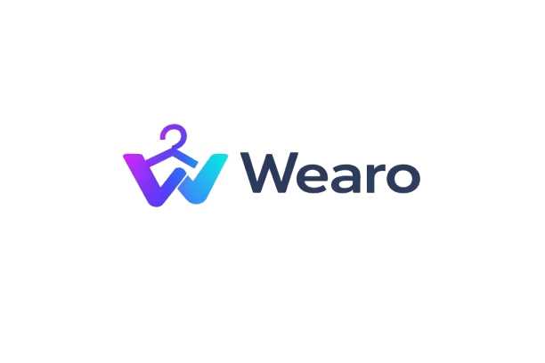

<p align="center">
  
</p>

<p align="center">
  <strong>Tu armario inteligente en el bolsillo</strong><br>
  Organiza tu ropa, crea outfits, planifica con el clima y comparte con la comunidad.
</p>

<p align="center">
  
  
  
  
  
</p>

---

## Sobre Wearo

Wearo es una app mobile completa de gestion de armario y red social de moda. Permite a los usuarios catalogar su ropa, crear combinaciones de outfits, planificar que ponerse cada dia segun el clima, y compartir sus looks con una comunidad. Incluye inteligencia artificial para recomendaciones personalizadas, mensajeria directa y un panel de administracion completo.

---

## Funcionalidades

### Armario Digital
- Fotografiar y catalogar prendas con deteccion automatica de color
- Filtrar por categoria, temporada, color y favoritos
- Seguimiento de uso (veces puesto, ultima vez)
- 8 categorias: camisetas, pantalones, zapatos, chaquetas, sudaderas, accesorios, vestidos y otros

### Outfits
- Crear combinaciones seleccionando prendas del armario
- Etiquetar por ocasion (casual, trabajo, formal, deporte, fiesta)
- Foto de portada personalizada
- Marcar favoritos

### Calendario
- Vista mensual para planificar looks
- Registrar que outfit te pusiste cada dia
- Marcadores visuales en dias con outfits planificados

### Inteligencia Artificial
- **Recomendaciones por clima** -- sugiere outfits de tu armario segun la temperatura y condiciones de tu ciudad (Google Gemini)
- **Chat con IA** -- pregunta sobre combinaciones, tendencias o consejos de moda
- **Recomendaciones de compra** -- analiza tu armario y sugiere que prendas te faltan
- **Transcripcion de audio** -- mensajes de voz convertidos a texto (Groq Whisper)

### Red Social
- Feed estilo Instagram con modos Descubrir y Siguiendo
- Publicar outfits con hasta 5 fotos y descripcion
- Likes y comentarios con respuestas anidadas
- Busqueda de posts y usuarios
- Compartir posts por mensaje directo

### Mensajeria Directa
- Conversaciones 1 a 1 en tiempo real
- Envio de texto, fotos y mensajes de audio con visualizacion de onda
- Compartir posts del feed social en chats
- Indicadores de mensajes no leidos

### Clima
- Clima en tiempo real en la pantalla principal
- Seleccion de ciudad con autocompletado
- Recomendaciones de outfit integradas con el clima

### Estadisticas
- Prendas por categoria (grafico de barras)
- Distribucion de colores (grafico circular)
- Prendas por temporada
- Actividad mensual
- Top outfits planificados
- Prendas mas versatiles

### Panel de Administracion
- Gestion de usuarios (crear, desactivar, eliminar, restaurar)
- Moderacion de contenido (posts y comentarios)
- Sistema de tickets de soporte
- Historial de acciones de cada admin
- Estadisticas del sistema

### Perfiles de Usuario
- Avatar y biografia personalizable
- Sistema de follow/unfollow con solicitudes
- Perfil publico con posts compartidos
- Modo oscuro / modo claro

---

## Stack Tecnologico

| Capa | Tecnologia |
|------|-----------|
| Mobile | React Native (Expo) |
| Estado | Redux Toolkit |
| Backend | Node.js + Express |
| Base de Datos | PostgreSQL |
| Autenticacion | JWT + bcrypt |
| IA | Google Gemini, Groq Whisper |
| Clima | OpenWeatherMap API |
| Imagenes | Multer + ColorThief |
| Deploy | Railway (backend + PostgreSQL) |

---

## Instalacion Local

### Requisitos
- Node.js 18+
- PostgreSQL 14+
- Expo Go en tu movil (iOS/Android)

### 1. Clonar el repositorio

```bash
git clone https://github.com/clpaco/Wearo.git
cd Wearo
```

### 2. Configurar el backend

```bash
cd backend
npm install
```

Crea un archivo `.env` basandote en `.env.example`:

```bash
cp .env.example .env
# Edita .env con tus claves reales
```

Crea las tablas en PostgreSQL:

```bash
psql -U postgres -d outfitvault -f src/config/setup.sql
```

Inicia el servidor:

```bash
npm run dev
```

### 3. Configurar el frontend

```bash
cd frontend
npm install
npx expo start
```

Escanea el codigo QR con Expo Go en tu movil.

---

## Despliegue en Produccion (Railway)

El backend y la base de datos estan preparados para Railway:

1. Crea un proyecto en [Railway](https://railway.com)
2. Conecta el repositorio de GitHub
3. Configura `backend` como Root Directory
4. Anade un servicio PostgreSQL
5. Ejecuta `setup.sql` en la base de datos
6. Configura las variables de entorno (ver `.env.example`)
7. Actualiza `apiUrl` en `frontend/app.json` con la URL de Railway

---

## Estructura del Proyecto

```
Wearo/
├── backend/
│   ├── src/
│   │   ├── config/         # Base de datos y SQL de setup
│   │   ├── controllers/    # Logica de endpoints
│   │   ├── middleware/      # Auth y admin middleware
│   │   ├── models/          # Queries a la base de datos
│   │   ├── routes/          # Definicion de rutas
│   │   ├── services/        # IA, clima y servicios externos
│   │   └── index.js         # Entry point del servidor
│   └── uploads/             # Archivos subidos por usuarios
├── frontend/
│   ├── assets/              # Iconos y splash screen
│   └── src/
│       ├── components/      # Componentes reutilizables
│       ├── hooks/           # Custom hooks (tema, etc.)
│       ├── navigation/      # Navegacion de la app
│       ├── screens/         # 19 pantallas de la app
│       ├── services/        # Llamadas a la API
│       └── store/           # Redux slices
├── build-ipa.sh             # Script para generar .ipa en Mac
├── .env.example             # Variables de entorno de referencia
└── README.md
```

---

## API Endpoints

| Ruta | Descripcion |
|------|------------|
| `POST /api/v1/auth/register` | Registro de usuario |
| `POST /api/v1/auth/login` | Login |
| `GET /api/v1/garments` | Listar prendas |
| `POST /api/v1/garments` | Crear prenda |
| `GET /api/v1/outfits` | Listar outfits |
| `POST /api/v1/outfits` | Crear outfit |
| `GET /api/v1/social/feed` | Feed social |
| `POST /api/v1/social/share` | Publicar outfit |
| `GET /api/v1/calendar/:year/:month` | Calendario mensual |
| `GET /api/v1/stats` | Estadisticas del armario |
| `POST /api/v1/ai/recommend` | Recomendacion IA por clima |
| `POST /api/v1/ai/chat` | Chat con IA |
| `GET /api/v1/messages/conversations` | Listar conversaciones |
| `GET /api/v1/profile/:id` | Perfil de usuario |
| `GET /api/v1/admin/users` | Panel admin - usuarios |
| `GET /api/v1/health` | Health check |

---

## Build iOS (.ipa)

Si tienes acceso a un Mac con Xcode:

```bash
git clone https://github.com/clpaco/Wearo.git
cd Wearo
bash build-ipa.sh
```

El script genera un `Wearo.ipa` sin firma, instalable con TrollStore o Sideloadly.

---

## Licencia

MIT
